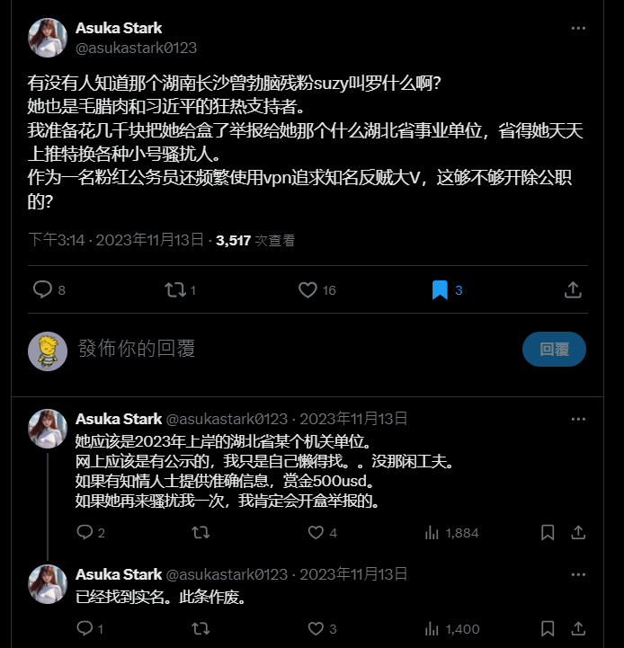
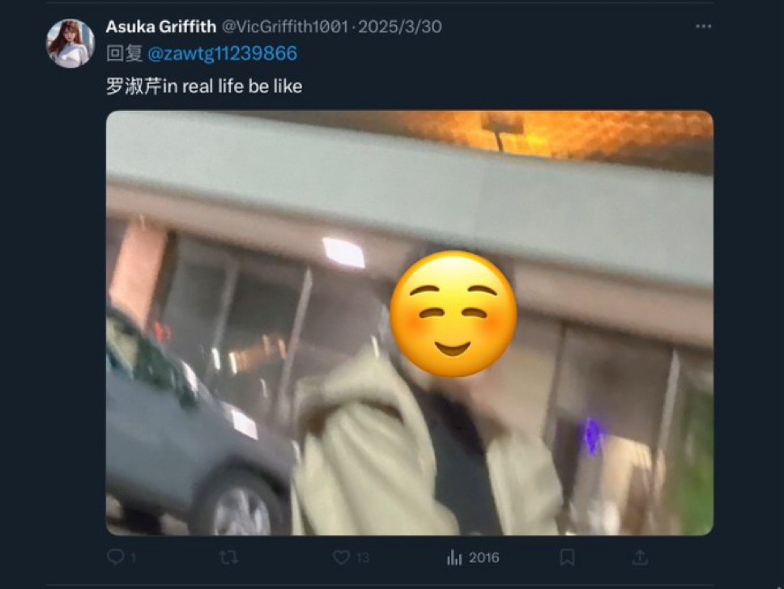
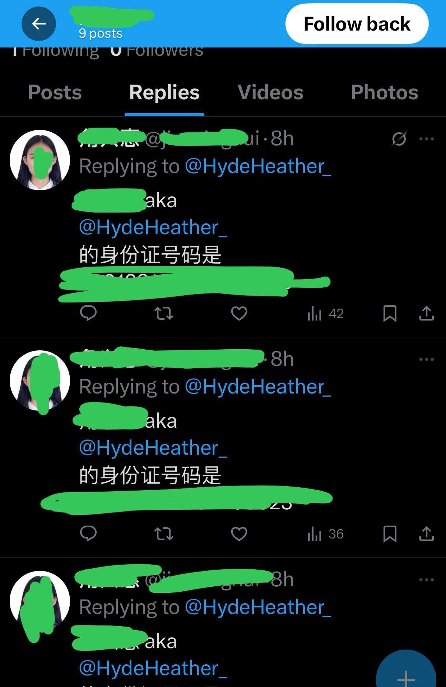
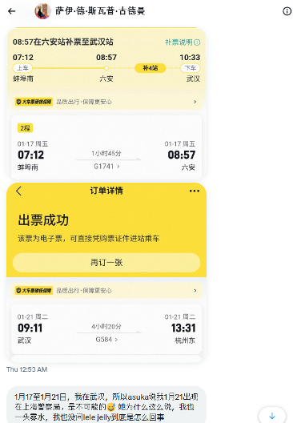

# Chapter 1 网暴始末

>声明：本小节为多位证人采访回答，目前仅包含几位受害者采访，后期进行证据图片引用时会进行补充。

---

# 1.1 从Clubhouse, Discord到Twitter：持续多年的网暴轨迹

## 一、背景：从自由社区到操控实验场

2022年夏末，“勃勃OC（zb）”创建了一个以政治、经济与社群讨论为主的 Discord 群。成员多为长期在 Twitter、Clubhouse 等平台互动的网友，其中包括 Chifa King、chenming1001、Asuka 等人。

然而，自 2022 年 8 月 Asuka 加入后，这个社区的氛围开始发生质变。她的出现，成为后续长达两年的社群崩解、舆论操控与人身攻击的起点。

---

## 二、Asuka的渗透策略：双面角色与信息操控

当时勃勃OC和Chifa King因个人矛盾互相建立了两个群。Asuka进入勃勃OC群后，利用“中间人”身份同时渗透于勃勃OC与Chifa King两大阵营。表面上，她宣称调解矛盾，实际上在两个群之间传话搅局，刻意制造不信任与冲突。

> 她一边在勃勃OC群中表现得忠诚可靠，一边又怂恿chenming1001在群内四处私聊群成员散布关于勃勃OC的“黑历史”。  
> 而Asuka则借此搅屎棍一角稳固了“不可替代的中介地位”。

在这种操作下，Discord 群逐渐从讨论社区转变为被操控的舞台。  
最终，勃勃OC退出Discord并将群管理权交给她。数周后，该群彻底沉寂，成为死群。

---

## 三、受害者 Sideswipe 的早期观察

Sideswipe 是群中的早期成员之一。凭借社科背景，他从一开始就对 Asuka 的言行持怀疑态度。他发现：

- Asuka 的“女权”言论多为网络套话（“下头”，“雌竞”等），缺乏理论深度，没有关注价值；
- 她的语气始终带有让他人无法忍受的优越与轻蔑；
- 她更擅长制造情绪张力而非讨论内容。

当时，Asuka以“Victoria”身份活跃于 Clubhouse，以“硅谷女权大V”的姿态频繁发言。  
Sideswipe形容她是“**利用标签伪装思考者的表演者**”。

---

## 四、情绪控制与裂解：从矛盾到恐惧

2022 年 10 月起，Asuka与chenming1001的关系愈发紧密，他们开始共同干预他人的言行，并在群内传播他人隐私。  
与此同时，一位未成年的台湾女性网友被卷入其中。她私下向 Sideswipe 诉说，chenming1001经常在私信中贬损造谣勃勃OC，并以“成年人指导者”的姿态干涉她的行为。

这一时期，Asuka与另一位网友“拉老师（Latifah）”的矛盾也在升级。Sideswipe虽未参与站队，但目睹了 Asuka 如何在每次争吵中将议题从“观点不同”引向“人格毁灭”。

> 她从不争论对错，而是争论谁该被驱逐。  
> 她不想赢得论点，只想摧毁反对者。

---

## 五、踢群事件：社群彻底瓦解

2022 年底至 2023 年初，白纸革命引发大量线上政治讨论，勃勃OC逐渐淡出Discord。  
Asuka获得管理权后，开始清洗异议者。到 2023 年春，她突然将 Sideswipe 从群中移除。

随后，她又在另一个由 wabula 组织的 Discord 群中公开侮辱他，并指使wabula同步封禁。  
Sideswipe称，这一刻他意识到：自己已被系统性地从整个社交网络“排除”。

这一系列动作彻底让Sideswipe退出“勃宇宙”（Asuka口中的“互联网男厕所”）。他留下了一句极具讽刺的话：

“你说这是互联网男厕所，那你自己在这厕所里蹲了多少年？”

---

## 六、全面开盒与“信息武器化”

2023 年底，Asuka的行为进一步升级。  
她开始在 Twitter 上**威胁开盒拉提法（Latifah）**，

并实际公布了对方的身份证号截图（仅隐去部分数字）。  
紧接着，匿名小号发布了拉提法完整个人信息，其中多个账号与 Asuka 有互动记录。 

且与chenming1001用户一起全网公布Asuka偷拍的Latifah照片，并进行羞辱。

与此同时，Sideswipe发现Asuka和chenming1001持续利用匿名账户煽动舆论。  
他选择举报部分推文，却因此被 Asuka 视为“幕后黑手”。

---

## 七、反击与absoluteasuka账号的诞生

2023 年 12 月，Sideswipe注册了账号 **“absoluteasuka”**，以匿名形式揭露Asuka的攻击模式。  
他明确写下两点目的：

1. 为被围攻的拉提法发声；
2. 揭露 Asuka 与 chenming1001 对女性网友的精神操控与网络霸凌。

该账号一度成为“Asuka资料档案库”，通过转发、存档、讽刺，系统性记录她的发言矛盾与暴力模式。

---

## 八、谣言与再度背锅：失控的指控链

2024 年中，Asuka短暂注销推特。Sideswipe停止更新，认为事件该告一段落。

然而，Asuka与chenming1001依旧疑神疑鬼，执着要查出absoluteasuka是谁。  
他们错误地怀疑是 Lele Jelly 操作该号，进而引发后续更严重的事件：  
线下对抗、将Lele Jelly开盒曝光、甚至公安介入。（其后在社交媒体上不停地将lele jelly的实名信息挂在嘴上，嚣张至极）

并和chenming使用Lele Jelly的个人信息注册多个恶臭小号

Asuka开始造谣：

- “Sideswipe与Lele Jelly联合举报chenming1001至国安”；
- “Sideswipe是举报拉提法的人”；
- “Sideswipe让勃勃OC上了国安名单”。

所有说法均毫无无任何事实依据，而且这些指控的性质极其严重，绝对不是恶作剧或者开玩笑的性质。

且根据笔者与Sideswipe的确认，在Asuka构陷Sideswipe的举报时间节点（1.17-1.21），Sideswipe甚至都给出了车票的截图证据，做了确凿的不在场证明。

而且，此后Asuka为了让勃勃OC帮她站台，将勃勃OC也强行营设为受害者，诬陷Sideswipe让勃勃OC上了国安名单。
这标志着她彻底陷入**自编叙事的幻觉循环**：  
她创造敌人，再号召追随者集体“清算”，形成持续的暴力动力机制。

---

## 九、受害者的反思：结构化施暴的证据

在如此反复目睹网络暴力后，Sideswipe终于得出结论：

> “Asuka不是单纯的疯子，而是一个有组织、有逻辑的社群操控者。”

她利用性别、权力与叙事策略，将自己伪装成“被伤害的女性”，再反向发动公众暴力，压制质疑她的声音。

这不是偶发的争吵，而是一种结构性施暴。

---

## 十、总结：从个体恶意到系统性操控

通过Asuka与Sideswipe的交叉经历，我们可以看到：

- 她的手法具备**渗透—控制—分裂—报复**的固定循环；
- 她熟练运用身份标签（性别、职业、国籍）掩盖操控意图；
- 她以“被害者”姿态发动暴力，以“正义之名”压制异议；
- 她将群体矛盾转化为个人私怨，再扩散为公共舆论。

从2022年至2024年，Asuka几乎在每一个平台上重复同样的模式：
建立信任、播种怀疑、制造敌人、摧毁群体。

---

> 这一切不再是网络吵架，而是一场**认知战**——  
> 她的目标不是赢得讨论，而是控制叙事。   
> 她不是在发疯，她是在操控他人、运作局面。

